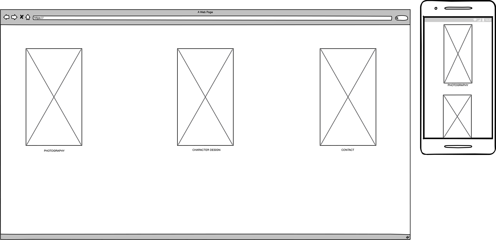
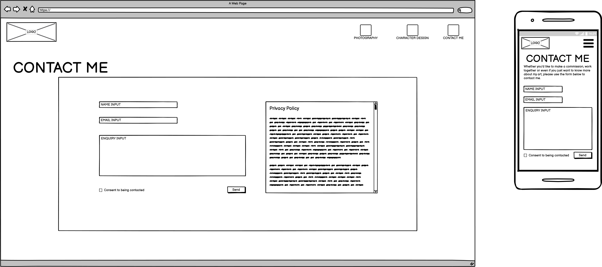

# Siana's Gallery

This website was produced by myself for Siana Gilbertson, an artist wanting to expand their personal brand and reach. Siana's Gallery was designed based upon Siana's knowledge of the art community that they are a part of and is influenced by websites of other artists (these websites will be credited below)

- [Siana's Gallery](#siana-s-gallery)
- [Design](#design)
    + [Desired Features](#desired-features)
    + [Wireframe Designs](#wireframe-designs)
        +[Homescreen Design](#homescreen-design)
        +[Contact Page Design](#contact-page-design)
        +[Photography Page Design](#photography-page-design)
- [Testing the website](#testing-the-website)
- [Deployment](#deployment)
- [Acknowledgements](#acknowledgements)

## Design
### Desired Features
- Two galleries for showing Siana's Photography and Character Design separately
- Unique 'Splash Screen' style menu as a separate page incorporating Siana's art
- Contact page to allow people to contact Siana for collaboration, commisions and questions
- Footer with icons linking to Siana's social media

### Wireframe Designs
#### Homescreen Design

- The boxes with crosses are images, specifically they are going to be characters designed by Siana. The design for these will be the characters falling from the sky.
- Each character will have text under it annotating what page it links to
- The sky will be the background of the image

#### Contact Page Design

- The contact page will have a contact form contained within a box.
- The background of the contact form itself will be a different colour to the rest of the page for contrast
- This design may differ from the finished project, as an alternative to having the icons for separate pages, having one icon to send the user back to the splash screen
- The box with text on the side will be a privacy policy as the user's data would be processed in order for them to contact Siana
- The hamburger button of the mobile view should take the user back to the home page/splash screen

#### Photography Page Design

- The photography and character design pages will be organised into four columns
- The pictures will each have a caption underneath it, detailing information regarding the image
- The mobile view will have a 'slideshow' style gallery, where per button click going back and forward the caption and the image will change.

## Testing The Website

This section will be for testing the website
  
## Deployment

This section will be about the deployment of the website to GitPages

## Acknowledgements

- W3Schools.com has provided insight and templates for the website and has been an invaluable tool (see w3schools.com)
- Stack Overflow has helped me troubleshoot issues regarding the HTML and CSS of the website as well as some issues regarding Gitpod that I encountered (See Stackoverflow.com)
- https://css-tricks.com/on-object-fit-and-object-position/ to help with positioning the images in the gallery
- https://www.w3schools.com/css/tryit.asp?filename=tryresponsive_col-s helped with responsivity of the gallery
- FontAwesome allows for the use of icons throughout the website, including the menu icon.
- Wallpaperaccess.com was used for a placeholder image of the sky
- Placeholder images are from placeimg.com

  
