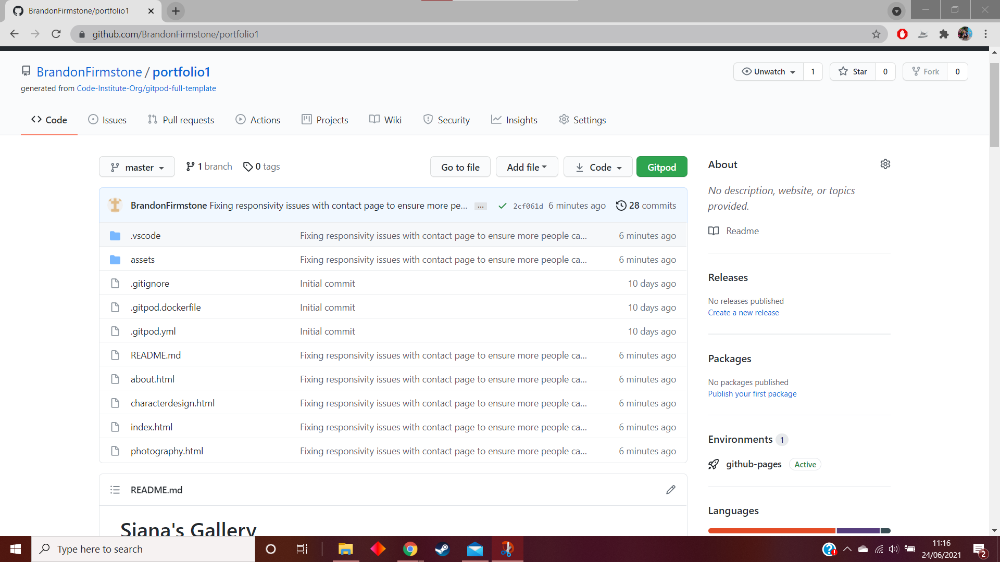
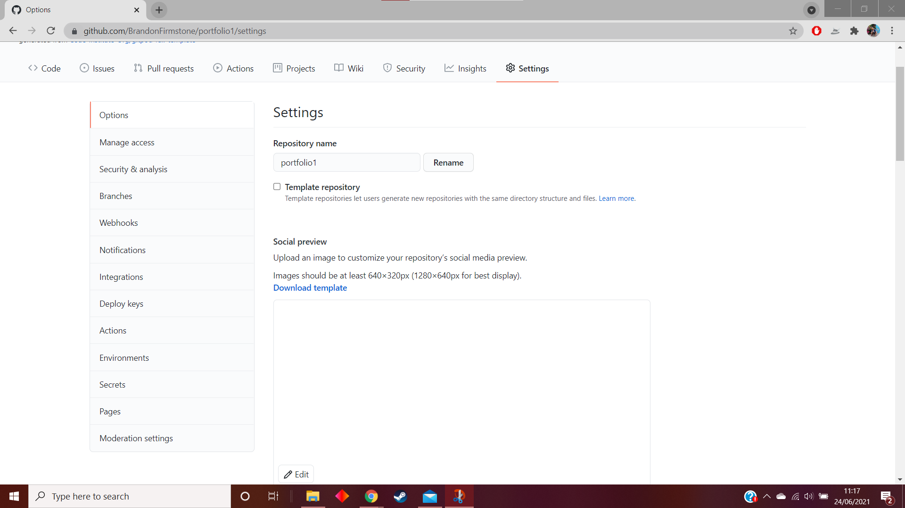
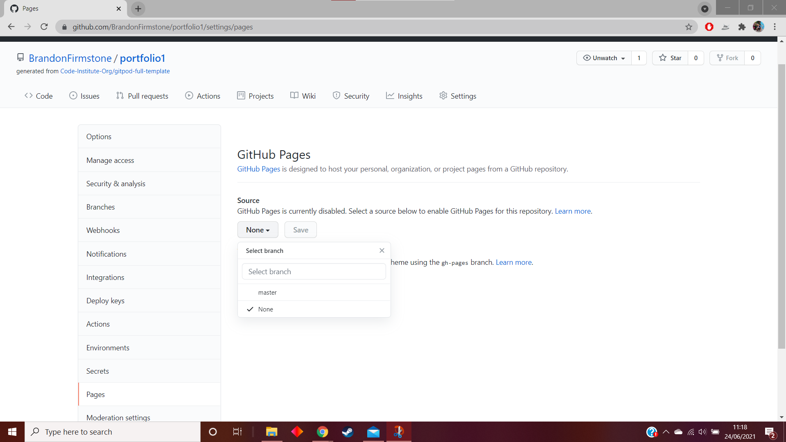
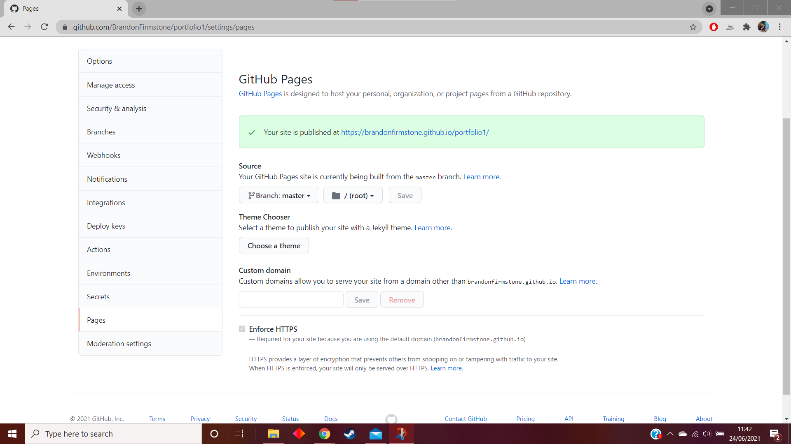
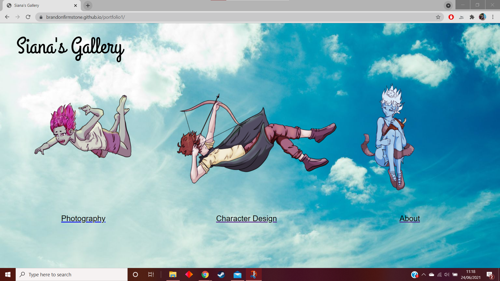

# Siana's Gallery

This website was produced by myself for Siana Gilbertson, an artist wanting to expand their personal brand and reach. Siana's Gallery was designed based upon Siana's knowledge of the art community that they are a part of and is influenced by websites of other artists (these websites will be credited below)

- [Siana's Gallery](#siana-s-gallery)
- [Design](#design)
    + [Desired Features](#desired-features)
    + [Wireframe Designs](#wireframe-designs)
        +[Homescreen Design](#homescreen-design)
        +[About Page Design](#about-page-design)
        +[Photography Page Design](#photography-page-design)
- [Testing the website](#testing-the-website)
- [Deployment](#deployment)
- [Acknowledgements](#acknowledgements)

## Design
### Desired Features
- Two galleries for showing Siana's Photography and Character Design separately
- Unique 'Splash Screen' style menu as a separate page incorporating Siana's art
- Contact page to allow people to contact Siana for collaboration, commisions and questions
- Footer with icons linking to Siana's social media

### Wireframe Designs
#### Homescreen Design

- The boxes with crosses are images, specifically they are going to be characters designed by Siana. The design for these will be the characters falling from the sky.
- Each character will have text under it annotating what page it links to
- The sky will be the background of the image

#### About Page Design (Previously Contact Page Design circa 22/06/2021)

- The contact page will have a contact form contained within a box.
- The background of the contact form itself will be a different colour to the rest of the page for contrast
- This design may differ from the finished project, as an alternative to having the icons for separate pages, having one icon to send the user back to the splash screen
- The box with text on the side will be a privacy policy as the user's data would be processed in order for them to contact Siana
- The hamburger button of the mobile view should take the user back to the home page/splash screen
/
##### About Page Design Changes
Due to time limitations, I will not be able to produce a wire frame for this new design. However, the layout will be very similar to the initial design. The about page will incorporate a contact form for the user to contact Siana, but extra information regarding the site owner and a video embedded from Youtube.com will be included. The contact form will be at the bottom of the page, the information regarding Siana at the top. The extra features to be included are as follows, in priority order:
- Information regarding Siana
- Video produced by Siana
- Call to action to fill in the contact form
- Small gallery, taking up one image space and revolving through the different images

#### Photography Page Design

- The photography and character design pages will be organised into four columns
- The pictures will each have a caption underneath it, detailing information regarding the image
- The mobile view will have a 'slideshow' style gallery, where per button click going back and forward the caption and the image will change.

## Testing The Website

This section will be for testing the website.

<table>
<tr>
<td> TOOL/DEVICE </td><td> BROWSER </td><td> OPERATING SYSTEM </td><td>SCREEN SIZE</td>
</tr>
<tr>
<td>REAL: Oppo Find X2 Lite</td><td></td><td></td><td></td>
</tr>
<tr>
<td>REAL: Honor 20</td><td></td><td></td><td></td>
</tr>
<tr>
<td>CHROME: Moto G4</td><td></td><td></td><td></td>
</tr>
<tr>
<td>CHROME: iPhone 5/SE</td><td></td><td></td><td></td>
</tr>
<tr>
<td>CHROME: iPhone 6/7/8</td><td></td><td></td><td></td>
</tr>
<tr>
<td>CHROME: iPad</td><td></td><td></td><td></td>
</tr>
</table>
  
  
## Deployment

This section will be about the deployment of the website to GitPages.

In order to deploy a GitHub Pages site, we must first go to the repository where the desired website is located.

This is the repository for this website. The next step is to go to the 'Settings' menu at the top of the page.

Then, we move to 'Pages' near to the bottom of this list on the left.

From this page, we go to 'Source' and select 'Master' from the dropdown list and save. Once we save, it refreshes the page and shows up as shown below.

The link in the green box now takes us to the deployed website. From here, I need to check that all of the images are loaded correctly and try the website on multiple browsers on multiple different devices. This is to ensure that the website is functional on as many different platforms and screensizes as possible.

The above is a screenshot of the splashscreen "index.html" on my laptop screen. The screensize is 1920px by 1080px. This shows that the images have loaded and that it looks as intended.

## Acknowledgements

- W3Schools.com has provided insight and templates for the website and has been an invaluable tool (see w3schools.com)
- Stack Overflow has helped me troubleshoot issues regarding the HTML and CSS of the website as well as some issues regarding Gitpod that I encountered (See Stackoverflow.com)
- https://css-tricks.com/on-object-fit-and-object-position/ to help with positioning the images in the gallery
- https://www.w3schools.com/css/tryit.asp?filename=tryresponsive_col-s helped with responsivity of the gallery
- FontAwesome allows for the use of icons throughout the website, including the menu icon.
- Wallpaperaccess.com was used for a placeholder image of the sky
- Placeholder images are from placeimg.com
- https://www.markdownguide.org/cheat-sheet/ Helped with producing this document
- https://stackoverflow.com/questions/33661263/footer-pops-up-halfway-up-page/33661595 helped with issues regarding the position of the footer
- https://codepen.io/raubaca/pen/PZzpVe Helped with researching the possibility of a responsive drop down menu under the burger button
- https://www.w3docs.com/snippets/css/how-to-set-the-size-of-a-checkbox-with-html-and-css.html helped with responsivity regarding the checkbox on the about page
- Using Google Fonts for the site's Logo. Specifically the Grand Hotel font.

  
