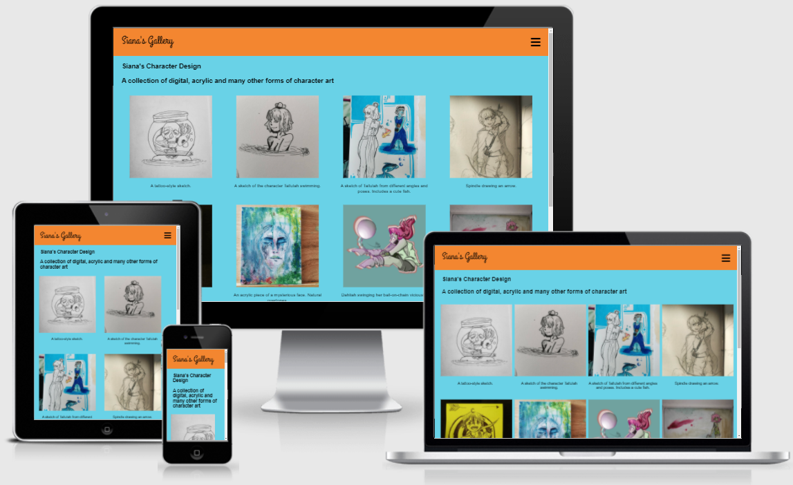
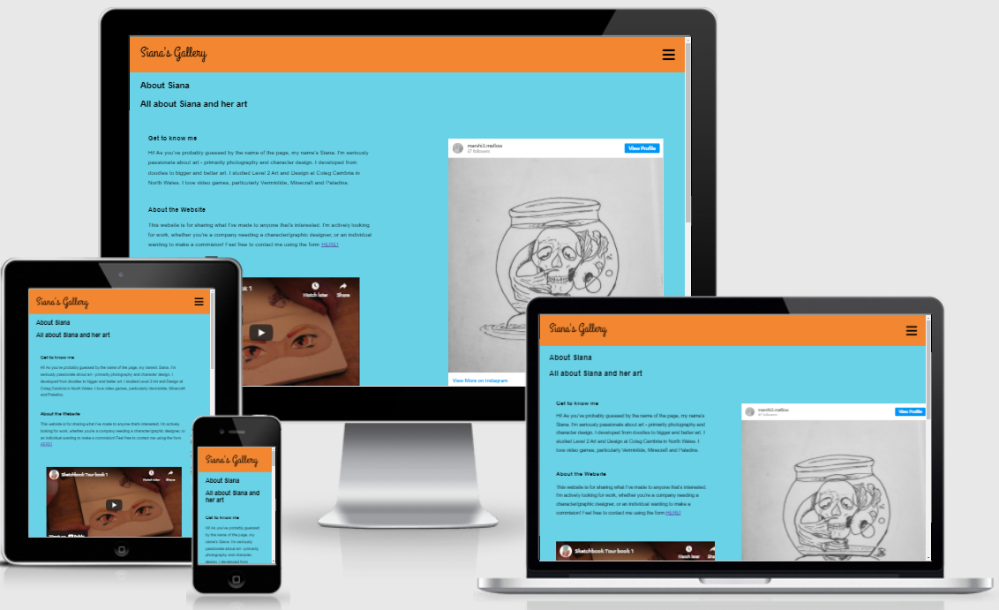
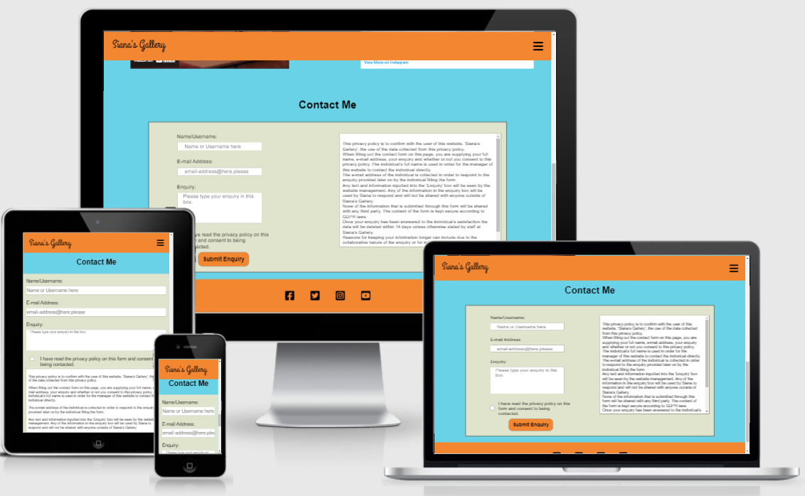

# Siana's Gallery

This website was produced by myself for Siana Gilbertson, an artist wanting to expand their personal brand and reach. Siana's Gallery was designed based upon Siana's knowledge of the art community that they are a part of and is influenced by websites of other artists (these websites will be credited below)

- [Website Purpose](#website-purpose)
- [Design](#design)
  * [Desired Features](#desired-features)
  * [Wireframe Designs](#wireframe-designs)
- [Features](#features)
  * [Implemented Features](#implemented-features)
  * [Future Features](#future-features)
- [Testing The Website](#testing-the-website)
  * [Bugs and errors](#bugs-and-errors)
  * [Testing Responsiveness](#testing-responsiveness)
  * [W3.org Validators](#w3org-validators)
- [Deployment](#deployment)
- [Acknowledgements](#acknowledgements)
- [Content](#content)
- [Media](#media)

## Website Purpose

The purpose of the website is for Siana to expand her personal brand awareness and to be more visible to potential clients and employers. Due to the nature of Siana's work, this needs to be done through a portfolio-style gallery to show the end user demonstrations of Siana's skills. The website should also appeal to the art community that Siana is a part of.

Website purpose: To expand Siana's personal brand and gain employment/clients 
 
Target audience: Employers, artistic community

## Design
### Desired Features
- Two galleries for showing Siana's Photography and Character Design separately
- Unique 'Splash Screen' style menu as a separate page incorporating Siana's art
- Contact page to allow people to contact Siana for collaboration, commisions and questions
- Footer with icons linking to Siana's social media

### Wireframe Designs
#### Homescreen Design

- The boxes with crosses are images, specifically they are going to be characters designed by Siana. The design for these will be the characters falling from the sky.
- Each character will have text under it annotating what page it links to
- The sky will be the background of the image

#### About Page Design (Previously Contact Page Design circa 22/06/2021)

- The contact page will have a contact form contained within a box.
- The background of the contact form itself will be a different colour to the rest of the page for contrast
- This design may differ from the finished project, as an alternative to having the icons for separate pages, having one icon to send the user back to the splash screen
- The box with text on the side will be a privacy policy as the user's data would be processed in order for them to contact Siana
- The hamburger button of the mobile view should take the user back to the home page/splash screen
/
##### About Page Design Changes
Due to time limitations, I will not be able to produce a wire frame for this new design. However, the layout will be very similar to the initial design. The about page will incorporate a contact form for the user to contact Siana, but extra information regarding the site owner and a video embedded from Youtube.com will be included. The contact form will be at the bottom of the page, the information regarding Siana at the top. The extra features to be included are as follows, in priority order:
- Information regarding Siana
- Video produced by Siana
- Call to action to fill in the contact form
- Small gallery, taking up one image space and revolving through the different images

#### Photography Page Design

- The photography and character design pages will be organised into four columns
- The pictures will each have a caption underneath it, detailing information regarding the image
- The mobile view will have a 'slideshow' style gallery, where per button click going back and forward the caption and the image will change.

## Features
 

### Implemented Features

 

#### Index page
 

The index page has been designed to highlight Siana's creativity. The actual index.html page is a splash screen navigation page. The page features three of Siana's main character designs falling through the sky. Each image can be clicked on to take you to the respective page and when hovering over the labels underneath the text scales in size and changes colour to white. This is to better show that they are clickable links. Siana did not want the page to include a footer, as the main focus should be the navigational links and the character art itself. However, temporarily to fix a responsivity issue detailed in the testing section, I've added a footer with Siana's agreement that it's more important for it to be responsive for the time being.

 

#### Character Design Page
 

The character page includes two rows of four images. Each image has a brief description underneath. The page title is included on the top as well as a small caption. Underneath all of the gallery images is an embedded YouTube video of Siana going through one of her sketch books.
The top bar includes the site logo, which upon hover turns white and increases to size (this links to the index.html page) and a burger button that changes white on hover. This pops a menu open that links to each page on the site. This was Siana's preferred approach for each device type. Rather than having the bar cluttered with navigational links on desktop, one burger button consistent on each screen size would suffice. When you click on any of the images, it opens the full size image in another tab. This is so that the user retains the website in their browser to return to. There is a footer on the bottom of the page linking to Siana's social media accounts. Each of the icons on the footer grow in size and rotate left or right alternatively in order to catch the eye of the user. Currently, only YouTube and Instagram have functioning links to Siana's accounts.

 

#### About page
 

The top of the about page details information about Siana and her interests. This page is used to tell the user a brief summary of what she does and the fact that she is open to work and also provides a means of contact. A YouTube and Instagram post is embedded to link to her two main social channels to gain brand awareness - one of the main goals of the website. The content in the about section was written by myself as a temporary placeholder for the content Siana wants to write. This about includes a call-to-action style link to the contact section at the bottom of the page.

This is the contact form used to get in touch with Siana. It contains four main fields:
- The full name in order for the user to tell Siana their name. The user does not have to fill this out as in the artist community people do not normally use their real names.
- The e-mail address is used for Siana to contact the user and is a required field - there's no point in the user filling out the form if Siana can't respond to them.
- The enquiry section uses a text area so that the user can type out whatever enquiry they would like. This isn't required as simply with their e-mail address Siana could contact them and ask what they contacted for.
- The consent checkbox is a required field with the attached label telling the user to read the privacy policy. The privacy policy, writted by myself, in a nutshell tells the user that their information will only be used to contact them and will not be saved longer than necessary. If this was not a required field there would be no point in the user filling out the form as they wouldn't be consenting to being contacted. 
  
The about page has changed considerably since the wireframe drawings. Originally just a contact page, the about page has evolved into a more practical being. The about section should help to draw the user into contacting Siana by telling them that she is open for work and any enquiries. There is also a link to the contact form in the about section acting as a text-based call to action.

#### 404 page

The 404 page shows when the user goes to an incorrect URL. It includes the burger button to help the user navigate to where they need to be. The content on the page also includes another link to the index page.

 

### Future Features

#### Index page
- No footer at the bottom of the page
- Animated characters on hover
- Caption under Siana's Gallery title
- Animation when transitioning to a different page

#### Character Design Page
- Case Studies under gallery to show what people have commisioned or what Siana has done in employment
- Sliding/revolution gallery on mobile view
- Image doesn't open to new tab - appears large in middle of page with x button in corner to close

#### Photography page
- Siana needs to transfer photographs to me in order for me to upload them
- Videos embedded in page such as nature vidoes, blogs, any freelance photography Siana has done.
- Call to action to go to contact page

#### About page
- Content provided by Siana for the contact page
- Contact information so that users can contact Siana themselves (IE a business telephone number and e-mail address.)
- Blog-style about me video done in an artistic manner (for example, see https://en.wikipedia.org/wiki/Draw_My_Life)

#### Store page
- A page with e-commerce features built in
- Used for purchasing prints and other artistic creations by Siana.

## Testing The Website

This section will be for testing the website.

### Bugs and errors

#### 26/06/2021 - Instagram Embedded Post (FIXED)
- Post functions normally under desktop conditions using a vertical scroll bar to view the whole post
- When in mobile view the Instagram post should go to 100% height so that the whole post can be seen
- When in mobile view, the post cannot be scrolled on and isn't the correct height
- Possible causes:
    + Container is preventing post from being full height
    + Container has overflow: hidden; property
        - Container column-about-right has property `overflow-y: visible;`

#### 28/06/2021 - Gap on Chrome Mobile (TEMP FIXED)
- No functionality is affected. When on Chrome on a mobile Android device, when you scroll down the top bar with the URL and tabs hides. This causes a gap on the bottom of the index page in the background image.
- To attempt to fix this I increased the html height to 120%.
- While the gap in the background is now hidden, the top bar on Chrome still causes a gap on the bottom and depending on how the user scrolls it can hide the 'about' caption on the bottom image. When scrolling, the bottom of the page appears to be above the text, but if you scroll again it shows the text. This is very non-intuitive for the user.
- This issue also appears through the Chrome Dev Tools
- To attempt to fix this, I will add a thin invisible div to the index page, so that hopefully that will be the hidden part of the page. Added the below to responsive CSS:
- ` .index-footer{ width: 100%; height: 80px; display: block;} `
- The above did not work. Unfortunately, to resolve this issue I've added the standard footer to the page. This has resolved the issue.

#### 28/06/2021 - Footer appears half way up 404.html page (FIXED)
- When you attempt to access a page that isn't actually a part of the website, the 404 page should be thrown up.
- When accessing the 404.html page through typing in an incorrect URL, the footer is half way up the page.
- To see how I could go about fixing this, I have temporarily added in-line CSS. ` style="position:fixed;bottom:0;"`
- As the 404 page does not work through Gitpod, I will have to push the code to Github and wait for Github Pages to update itself to see.
- This inline CSS has fixed the issue.

#### 28/06/2021 - Gallery images are too large (FIXED)
- When loading up the website, the images take some time to load.
- This is because the images have not been compressed at all.
- In order to fix this, I have used tinypng.com to quickly reduce the file size of these images.
- When loading the characterdesign.html page after emptying the cache, it loads considerably faster.

### Testing Responsiveness
<table>
<tr>
<td> TOOL/DEVICE </td><td> BROWSER </td><td> OPERATING SYSTEM </td><td>SCREEN SIZE</td><td>RESULT</td>
</tr>
<tr>
<td>REAL: Oppo Find X2 Lite</td><td>Opera Browser</td><td>Android 11</td><td>W1080px X H2400px</td><td>index.html: no issues. photography.html: no issues. characterdesign.html: no issues. about.html: no issues. </td>
</tr>
<tr>
<td>REAL: Honor 20</td><td>Chrome</td><td>Android 11</td><td>W1080px x H2340px</td><td>index.html: Noticed that on the index page there is a blank space when scrolling down due to Chrome hiding the url bar at the top. No other issues</td>
</tr>
<tr>
<td>CHROME: Moto G4</td><td>Chrome Developer Tools</td><td>Windows 10</td><td>W360px x H640px</td><td>No issues found</td>
</tr>
<tr>
<td>CHROME: iPhone 5/SE</td><td>Chrome Developer Tools</td><td>Windows 10</td><td>W320px x H568px</td><td>No issues found</td>
</tr>
<tr>
<td>CHROME: iPhone 6/7/8</td><td>Chrome Developer Tools</td><td>Windows 10</td><td>W375px x H667px</td><td>No issues found</td>
</tr>
<tr>
<td>CHROME: iPad</td><td>Chrome Dev Tools</td><td>Windows 10</td><td>W768px x H1024px</td><td>No issues found</td>
</tr>
</table>
 

### W3.org Validators 
 

#### HTML Validator
 
The first test using the HTML Validator available through validator.w3.org showed three errors on the index page. See below:

To fix these three errors I added alt text to the images on the index.html page. For example: ``

Next, I tested the character design page. It showed the following warning:

This test came up with a warning that the section I used for semantics had no heading. To fix this, I moved the starting tag of the section to above the header. I checked the photography page for this same error but found that I had not added a section tag. So, I added a section tag around the header of the page and the contents.

When testing the photography page the errors that came up were the same as the index page. No alt text was applied to any of the images present. At this time (25/06/2021 17:00) I have not been supplied any of the images to be put on the website by Siana, so I have used placeholders in the mean time. Until then, I will not know what alt text to add.

Finally, testing the about page using the validator showed the following errors:

All of the errors shown bar the warning at the top are from the code provided by Instagram for embedding a post. At this time, I don't believe there is any reason to fix it as it is code provided by Instagram and I do not have the technical knowledge to understand the issues. However, I have fixed the section warning in the same manner that I fixed it on the character design and photography pages. 

#### CSS Validator

I have tested the site using jigsaw.w3.org's css validator. The website passed the validator's tests as you can see in this link:
https://bit.ly/sianas-gallery-css-validator

## Deployment

This section will be about the deployment of the website to GitPages.

In order to deploy a GitHub Pages site, we must first go to the repository where the desired website is located.

This is the repository for this website. The next step is to go to the 'Settings' menu at the top of the page.

Then, we move to 'Pages' near to the bottom of this list on the left.

From this page, we go to 'Source' and select 'Master' from the dropdown list and save. Once we save, it refreshes the page and shows up as shown below.

The link in the green box now takes us to the deployed website. From here, I need to check that all of the images are loaded correctly and try the website on multiple browsers on multiple different devices. This is to ensure that the website is functional on as many different platforms and screensizes as possible.

The above is a screenshot of the splashscreen "index.html" on my laptop screen. The screensize is 1920px by 1080px. This shows that the images have loaded and that it looks as intended.

## Acknowledgements

- W3Schools.com has provided insight and templates for the website and has been an invaluable tool (see w3schools.com)
- Stack Overflow has helped me troubleshoot issues regarding the HTML and CSS of the website as well as some issues regarding Gitpod that I encountered (See Stackoverflow.com)
- https://css-tricks.com/on-object-fit-and-object-position/ to help with positioning the images in the gallery
- https://www.w3schools.com/css/tryit.asp?filename=tryresponsive_col-s helped with responsivity of the gallery
- FontAwesome allows for the use of icons throughout the website, including the menu icon.
- Wallpaperaccess.com was used for a placeholder image of the sky
- Placeholder images are from placeimg.com
- https://www.markdownguide.org/cheat-sheet/ Helped with producing this document
- https://stackoverflow.com/questions/33661263/footer-pops-up-halfway-up-page/33661595 helped with issues regarding the position of the footer
- https://codepen.io/raubaca/pen/PZzpVe Helped with researching the possibility of a responsive drop down menu under the burger button
- https://www.w3docs.com/snippets/css/how-to-set-the-size-of-a-checkbox-with-html-and-css.html helped with responsivity regarding the checkbox on the about page
- Using Google Fonts for the site's Logo. Specifically the Grand Hotel font.
- https://css-tricks.com/snippets/css/scale-on-hover-with-webkit-transition/ helped with animating the text on the index.html page.
- Used https://ecotrust-canada.github.io/markdown-toc/ to generate a table of contents

## Content

Content on the page was written by myself (Brandon) and Siana. The privacy policy, temporary image descriptions in the photography page and the text in the about section was my doing. Soon, Siana will create her own content to overwrite these (bar the privacy policy).

## Media

All media on the page was created by Siana except the following:
- Photography page gallery has placeholder images as mentioned in the acknowledgements section. These are from placeimg.com
- The site's temporary favicon (an artist's pallet) is from favicon.io
- Siana created the embedded media. She created the YouTube video in the characterdesign.html page and in about.html. The Instagram post embedded in about.html is also her creation.

  
